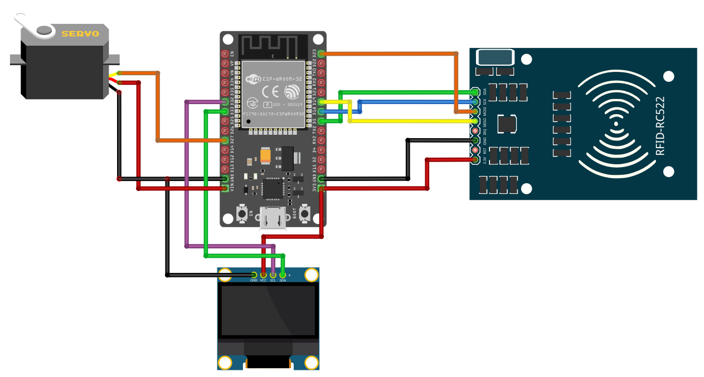

# Smart Door Lock Simulation with Rust and ESP32

In this project, we simulate a smart door lock system using an ESP32 microcontroller and RFID, written in Rust. Optionally, a servo motor can be used to simulate door opening, and an OLED display can show "Access Granted" or "Access Denied" messages.

## Components

- ESP32 microcontroller (suggestion: Devkit v1)
- RC522 RFID Card Reader Module: Comes with one tag and one keyfob
- \[Optiona\]: 0.96-inch OLED monochrome module: Displays feedback messages such as "Access Granted" or "Access Denied."
- \[Optiona\]: SG90 Micro Servo Motor: Simulates a door lock by opening or closing a cardboard door based on authentication.

## Related Tutorials

You can refer to the following tutorials in the "impl Rust on ESP32" book to learn how to use the servo, OLED, and RFID reader with the ESP32.

- [Using RFID Reader Module with ESP32](https://esp32.implrust.com/rfid/index.html)
- [Using Servo Motor with ESP32](https://esp32.implrust.com/servo/index.html)
- [Using OLED Display Module with ESP32](https://esp32.implrust.com/oled/index.html)

## Circuits

**Connecting ESP32 with RFID**:

| ESP32 Pin | RFID Reader Pin                               |
|-----------|-----------------------------------------------|
| 3.3V      | 3.3V                                         |
| GND       | GND                                          |
| GPIO 5    | SDA (acts as CS pin when using SPI)          |
| GPIO 18   | SCK                                          |
| GPIO 19   | MISO                                         |
| GPIO 23   | MOSI                                         |


**\[Optiona\] Connecting ESP32 with OLED**:

| ESP32 Pin | OLED Pin |  
|-----------|----------|  
| 3.3V      | VCC      |  
| GND       | Ground   |  
| GPIO 32   | SCL      |  
| GPIO 33   | SDA      |  


**\[Optiona\] Connecting ESP32 with Servo**:

| ESP32 Pin | Servo Motor |  
|-----------|-------------|  
| VIN       | Power (Red Wire)   |  
| GND       | Ground (Brown Wire) |  
| GPIO 27   | Signal (Orange Wire) | 





## How to Run?

### Write Auth Data

We will change the Auth Key A and Key B of the RFID for sector 1. The Key A will be set to "Rusted" and the Key B will be set to "Ferris". These keys are defined in the `rfid.rs` module. **Do not attempt to change the keys without reading the RFID tutorial**, as it may make your card or the specific sector inaccessible.

To write this authentication data into the tag, flash the `change_auth` binary onto the ESP32 using the following command:

```
cargo run --bin change_auth --release
```

Next, bring the tag you want to modify near the card reader.  This will update the Sector 1 data of the tag with our access keys.

### Access Control

Now, you can now set up the OLED, servo, or both, and then run the following command to flash the access control code:

```
cargo run --bin access_control --release -F servo,oled
```

The `servo` and `oled` are optional features that can be enabled as needed.

After flashing the code, bring the tag with the changed auth keys near the reader. It will show "Access Granted" on the OLED, and the servo motor will turn 90 degrees (you can use a cardboard box to simulate a door). Then, bring the other tag (keyfob) near the reader. It will show "Access Denied" on the OLED, and the servo motor will not move.
